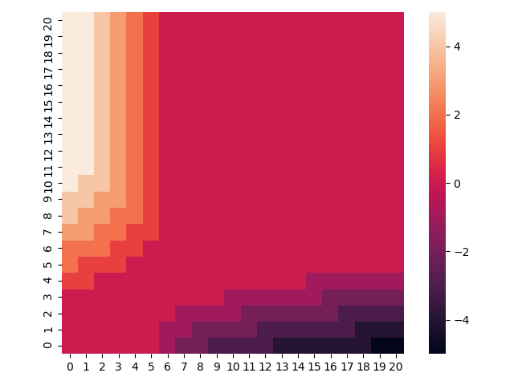
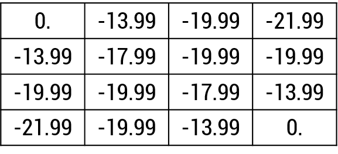

## RL Basic
1. Jack's Car Rental
2. Small Grid World


### Usage
1. Jack's Car Rental

```python JacksCarRental.py```

2. Small Grid World

```python SmallGridWorld.py```


### Problem Definition

1. Jack's Car Rental

The car rental company owns two branches (A and B). In this case, the average number of vehicles rented per day is (3,3) and (4,2), respectively.
The number of vehicle rentals and returns is generated by the Poisson distribution.
The two points can each accommodate up to 20 vehicles, and the maximum number of vehicles traveling between points per day is limited to five.
Car rental compensation is $10 for each vehicle at the time of borrowing, and -$2 for moving the vehicle to another location. Also, the expected factor for the future reward is 0.9.

2. Small Grid World

Episodic MDP problem where the index positions (0,0) and (3,3) are terminal states at grid states of 4x4.
There are four types of Action: Upper, Lower, Left, and Right.
If the action is taken outward from the edge state (which does not exist on the state matrix), it will return to its place.
Action Reward is -1 and Transition Prob is 1. The Discount factor is also 1.
Since it is Random Policy, take a fixed probability of 0.25 for each action.

### Figure

1. Jack's Car Rental Optimal Policy(Policy Evaluation & Policy Improvement)
 

2. Small Grid World Optimal Value(Policy Evaluation)
 
